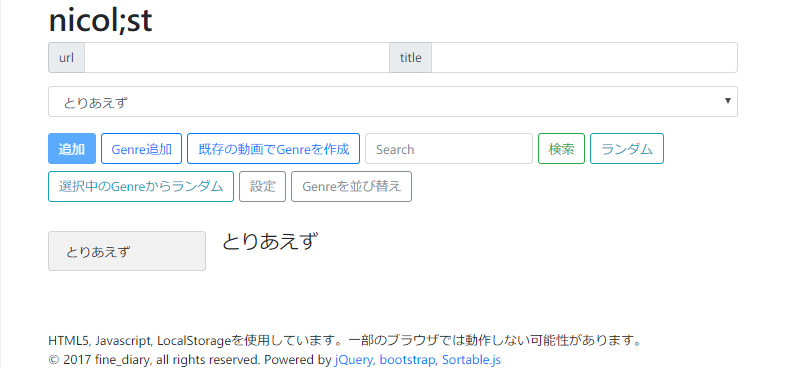
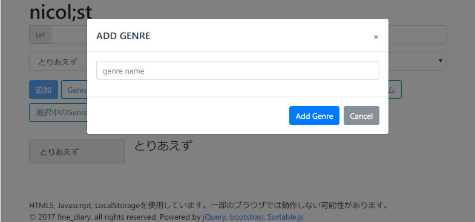
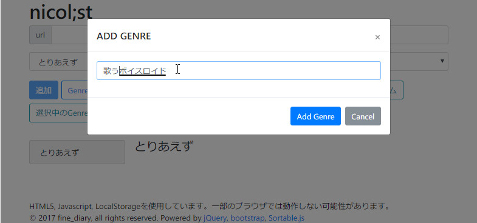
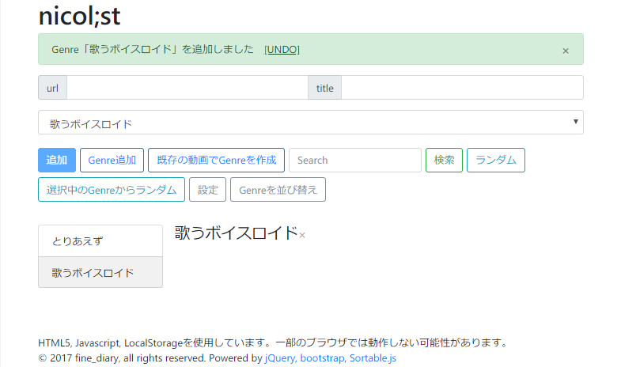
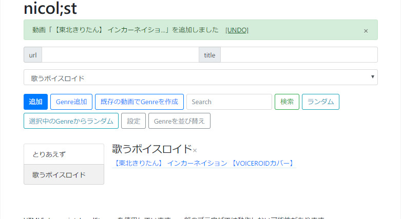

# nicol;st

### 概要
ニコニコ動画の動画タイトルをIDとともに保存するJavascript。  
公式のマイリストではできないマイリスト内検索など、面白い機能や便利なツールを自由に追加できる(ようにしていきたい)  

### デモページ
[http://jar.oiran.org/app/nicolist/](http://jar.oiran.org/app/nicolist/)
Downloadし、index.htmlを開いても良い

### 基本的な使い方
1. index.htmlをGoogle Chromeなどで開く
2. 動画のURLとタイトルをコピーペースト、またはドラッグ&ドロップ(以降D&Dと略記)
3. 「追加」を押し保存

### Getting Started

最初はちょっと殺風景すぎて使いにくい。

ジャンルを追加してみると見やすくなる。

動画を追加するときはDrag&Dropで。
(i)マークをD&Dするか、別の方法として、リンクをD&DするとURLが添付されるのを使っても便利。

動画タイトルは範囲選択で。範囲選択したテキストをD&Dすると選択されていたテキストが添付される。

追加完了

### 現在の機能一覧
* ニコニコ動画、Youtubeの動画を登録可能
* D&Dがし易いよう、ページの左側にドロップしたらURLのフォームにURLが入力される
* タイトルも同様にしてD&Dでページの右半分にドロップすれば入力される
* 動画の編集/削除 (右クリックによりcontext menuから編集)
* ジャンルによる区分 (ジャンルとはマイリストの名前のようなもの)
* ジャンルの削除
* ジャンル内、または全ジャンルに渡って無作為に動画を選ぶ (Randomボタン)
* サムネの表示
* 全動画から検索 (部分一致 / AND検索)
* 同期に利用できるJSONデータの外部出力/入力 (設定ウィンドウのTextarea)
* URLのD&D時にサムネやその動画が既に登録されているジャンルの情報を表示する
* 基本操作のUNDOやREDO
* 既存の動画を選択してジャンルを作成
* ジャンルを並び替え

### 追加を検討している機能
* 動画を並び替え
* チェックボックスにて複数個の移動
* EditをRenameとMoveに分割
* チェックボックスにて複数個の削除
* Ctrlによる選択 (チェックボックスの手間を省く工夫)
* 選択モード (チェックボックスの手間を省く工夫)
* クエリによるジャンル (ex: from all contains '実況') formによるクエリ作成

### ハードルが高い
* 連続再生