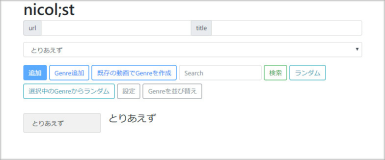
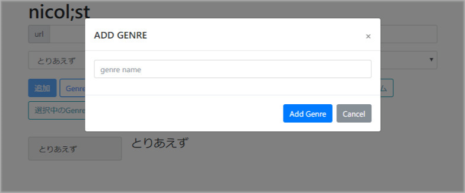
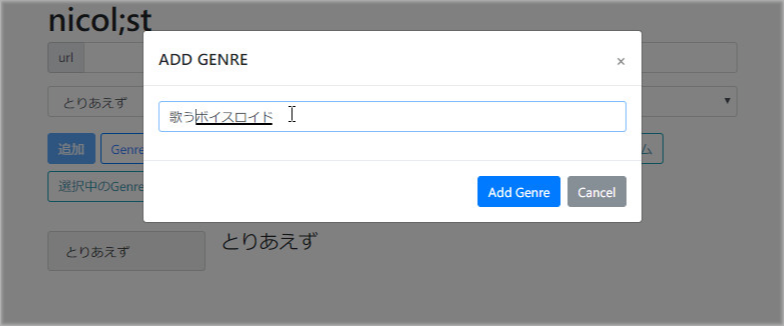
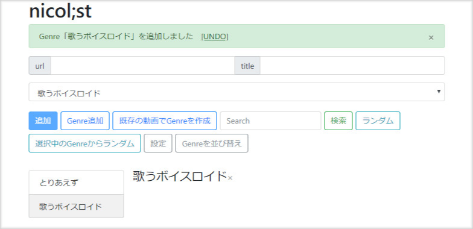
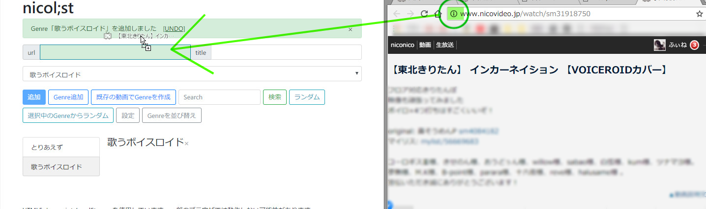
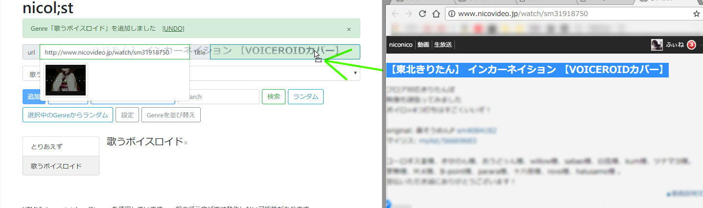
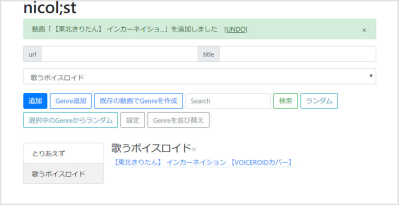

# nicol;st

### 概要
ニコニコ動画の動画タイトルをIDとともに保存するJavascript。  
公式のマイリストではできないマイリスト内検索など、面白い機能や便利なツールを自由に追加できる(ようにしていきたい)  

### デモページ
[https://tkgwku.github.io/n/index.html](https://tkgwku.github.io/n/index.html)
~~Downloadし、index.htmlを開いても良い~~ file:///ドメイン下ではnicolistページ内で動画を見ることができない

### 基本的な使い方
1. [nicolist](https://tkgwku.github.io/n/index.html)をGoogle Chromeなどで開く
2. 動画のリンクをコピーペースト、またはドラッグ&ドロップ(以降D&Dと略記)
3. 「追加」を押し保存

### Getting Started
  
最初はちょっと殺風景すぎて使いにくい。  
  
ジャンルを追加してみると見やすくなる。  
  
  
   
情報はD&Dで自動入力できる   
(実は新機能で、リンクをD&Dするとタイトル情報などが自動入力される。)   
  
範囲選択したテキストをD&Dするとフォームに自動で入力される。   
  
追加完了  

### 現在の機能一覧
* ニコニコ動画、Youtubeの動画を登録可能
* リンクをD&DするとURLだけでなくリンクのタイトル情報をフォームに自動入力
* D&Dがし易いよう、ページの左側にドロップしたらURLのフォームにURLが入力される
* タイトルも同様にしてD&Dでページの右半分にドロップすれば入力される
* 動画の編集/削除 (右クリックによりcontext menuから編集)
* ジャンルによる区分 (ジャンルとはマイリストの名前のようなもの)
* ジャンルの削除
* ジャンル内、または全ジャンルに渡って無作為に動画を選ぶ (Randomボタン)
* サムネの表示
* 全動画から検索 (部分一致 / AND検索)
* 同期に利用できるJSONデータの外部出力/入力 (設定ウィンドウのTextarea)
* URLのD&D時にサムネやその動画が既に登録されているかどうかの情報を表示する
* 基本操作のUNDOやREDO
* 複数動画を選択してコピーまたは移動
* 複数動画を選択して新規ジャンルにコピーまたは移動
* ジャンルを並び替え
* ページ内で再生
* 連続再生 (一覧 / ランダム / 検索)
* ランダム連続再生

### 今後追加するかもしれない機能
* 動画を並び替え
* ジャンルの名前を変更
* 複数動画の同時削除
* Ctrlによる選択
* itunesのような便利なプレイリストで連続再生
* プレイリストを作成・保存・再生

### 追加しなさそうな機能 / 追加が難しい機能
* トップ画面で選択モード
* クエリによるジャンル (ex: from all contains '実況') formによるクエリ作成   
* タグ付け
* 再生数情報などの取得

### Known Issue
* チャンネル動画はサムネイルが取得できない
* idが全て数字ならyoutubeの動画とチャンネル動画が区別できない